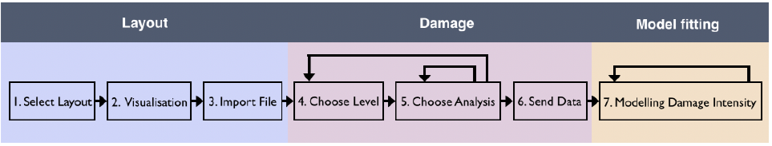
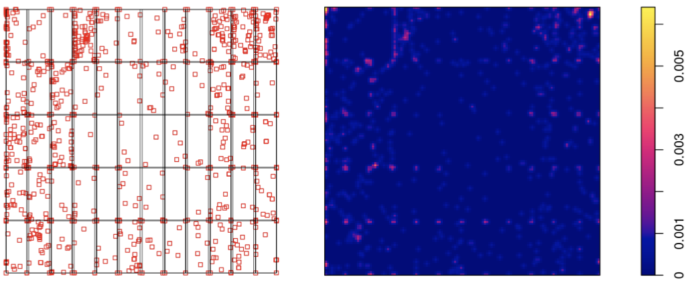
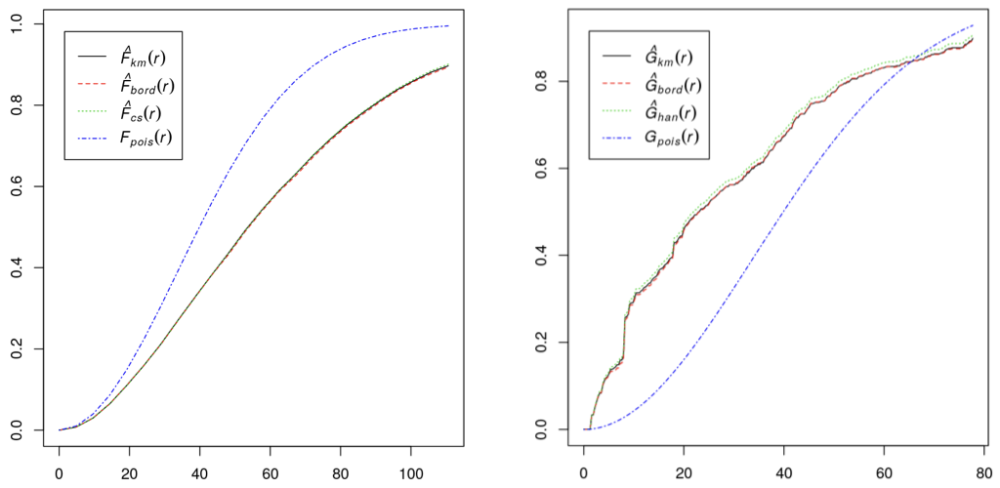
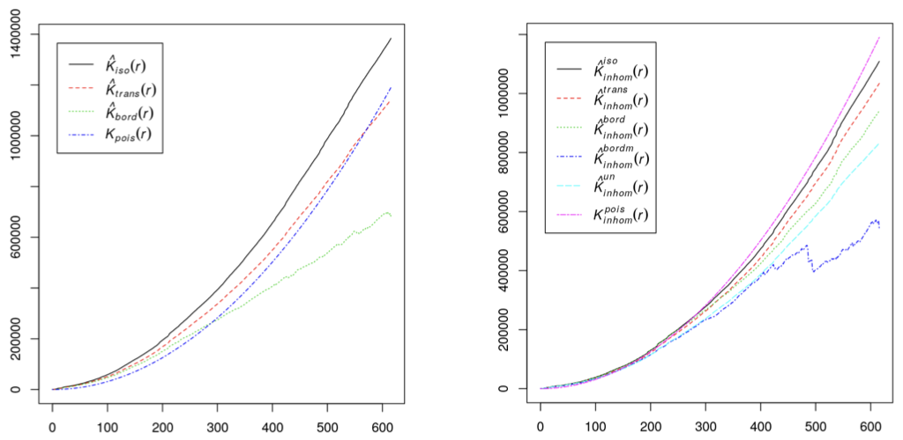

```
Version: 1.1.7
Replaced last 6 figures by JAB's combined plots. Need to amend text! 12.02.20.
```

_DetectorChecker_ is an R package and a web application for
users who need to analyze spatial patterns of defects in images.
These images can be _panel-structured_, which is to say,
composed of sub-panels arranged in an architecture which can be
specified by the user.
Primary intended beneficiaries are people responsible for
high-value digital detector screens used in X-ray computerised tomography (XCT),
where defects arise due to high radiation flux.
More generally the software can be used to analyse defects in other
panel-structured arrays, for example solar panels or very large display screens.
To maximize accessibility and to avoid any requirement to engage with a specific software environment,
we have created a web application which provides
the principal features of the software in standalone form.
The web application also affords the possibility of engaging with our team in extended analysis
of defect patterns as they evolve over time.


Digital detector screens are crucial high-value components of imaging systems used throughout
modern science  and engineering systems, particularly in X-ray computerised tomography (XCT).
Screen quality is typically strongly linked to system performance:
in the case of XCT this is noted by @YaffeRowlands-1997,
while the @FDA-2018[^3] advises to replace XCT detector screens after order of 10 years use.
Screen replacement or refurbishment is expensive;
regular checks of screen pixels are needed (a) to quantify screen quality
and (b) to assess possible _special causes_ of defective pixels,
using the terminology of classic quality control established by @Shewhart-1939.
This is best done by means of considerations of spatial statistics,
both to determine the extent to which spatial patterns of defective pixels
can be accounted for by quantifiable independent random variation
and also in describing departures from spatial randomness in ways
which are suggestive of possible explanations (for example, stress due
to screen attachment, or failure at pixel level of data readout).
Methods of spatial statistics are crucial for this task: @ChiuStoyanKendallMecke-2013
discuss some theoretical foundations
while
@BaddeleyRubakTurner-2015 describe an implementation of spatial statistics methods as the _spatstat_ package in the
R statistical computing environment [@RFoundation-2019].
_DetectorChecker_ [@tomas_lazauskas_2020_3662233] is an R package which adapts methods from _spatstat_ to the case of panel-structured images,
and analyses point patterns which may arise either from
individual defects or from "clumps" of defects (determined in a manner specified by the user).
The associated web application
[_DetectorCheckerWebApp_](https://detectorchecker.azurewebsites.net/)
[@tomas_lazauskas_2020_3662235]
is based on a self-contained R environment together
with a _Shiny_ gui, implemented and made available _via_ _Azure_, so as to expose the
basic functionality of the R package without the need for users to install R.
In particular the web application  can be used
to define the geometry of the panels of the detector screen
(which is to say, the arrangement and size of the component sub-panels),
to upload the spatial arrangement of the defective pixels either
directly by means of "bad pixel maps" (XML format) or inferred from test images (formats including TIFF),
and then to inspect the results using the facilities offered
by the package.
The software is freely available under MIT licence, accessible from the two Zenodo repositories
referenced above.
To the best of our knowledge, there is no other comparable package or web application
making methods of spatial statistics available for panel-based image data of arbitrary architecture.

[^3]:
  JAB to verify @FDA-2018!

Defects are modelled as points in an image rectangle based on screen dimensions. 
The pattern of defects can be modelled using the web application: the workflow is
summarised in Figure \ref{fig:figure1}.

1. The user specifies the exact architecture
of the sub-panels of the panel-structured image.
This can be done either by using a drop-down menu to specify a predetermined option,
or by uploading a file giving the specific structure of sub-panels.
The data is then uploaded.
2. Intensity maps can be visualized _via_ kernel smoothing applied to the point pattern
(replacing each defect point by the corresponding translate of a fixed kernel function).
For example, the point pattern in Figure \ref{fig:figure2}(a) yields the intensity map given in Figure \ref{fig:figure2}(b).
3. Departure from completed randomness can be assessed using visual inspection of graphs
of $F$, $G$ and $K$ functions as described in @ChiuStoyanKendallMecke-2013. It is clear that the
point pattern of Figure \ref{fig:figure2}(a) is definitely inhomogeneous and therefore it is
not surprising that the following graphical plots 
indicate clear evidence of deviation from CSR:  
    + the $F$ function or "empty space function"
    computes the empirical distribution of the nearest distance to a defect point from a typical location
    chosen uniformly from the image rectangle; if the point pattern was in fact
    generated by a homogeneous Poisson
    point process of intensity $\lambda$ (_complete spatial randomness_, or CSR), then
    the $F$ function would be a random perturbation of $F(r)=1-\exp(-\lambda \pi r^2)$. See Figure \ref{fig:figure3}(a),
    which presents different 
    variants accounting in various ways for edge-effects.
    Note the clear deviation of the empirical $\hat{F}$ functions from what would be expected under CSR, namely  $F_\text{pois}$.
    + the $G$ function computes the empirical distribution of nearest-neighbour distances between defect points; if the point pattern was in fact CSR with intensity $\lambda$, then the $G$ function would also be a random perturbation of $F(r)=1-\exp(-\lambda \pi r^2)$. See Figure \ref{fig:figure3}(b), and note the clear deviation of the empirical $\hat{G}$ functions from $G_\text{pois}$, hence again suggesting deviation from CSR.
    + the $K$ function (Ripley's $K$ function) computes the empirical mean number of defect points within a distance $r$ of a typical defect point, viewed as a function of $R$; if the point pattern was in fact CSR with intensity $\lambda$, then the $K$ function would be a random perturbation of $K(r)=\pi r^2$. See Figure \ref{fig:figure4}(a), and note the deviation of the empirical $\hat{K}$ functions from $K_\text{pois}$, especially at short distances, once more suggesting deviation from CSR.
    The excess over $K_\text{pois}$ at short distances, particularly for $\hat{K}_\text{iso}$, indicates that defects are more clustered than would be expected from CSR. 
    + Plots are also available which compute these functions in a way which accounts for inhomogeneity: 
    Figure \ref{fig:figure4}(b) gives an example of this in the case of the $K$ function. The plots of the empirical inhomogeneity-adjusted $\hat{K}_\text{inhom}$ functions agree much more closely with 
    $K^\text{pois}_\text{inhom}$ at short distances, supporting the hypothesis that the pattern of defects is what
    might be expected to arise from an _inhomogeneous_ Poisson process of defects.
4. Finally the relationship of the defect points to sub-panel boundaries can be studied by means of various logistic regression options, which assess whether damage intensity appears to depend on distance from the centre of the image or horizontal or vertical distance from sub-panel edges.


The web application also provides for further graphical options,
such as the study of direction from a typical defect point to
its nearest neighbour within the panel,
analysis at the level of "events" (appropriately defined grouping of clumps of defect pixels) rather than individual defect points (actually Figure \ref{fig:figure2} does in fact refer to an event-level analysis),
and exclusion of regions of the image rectangle for which the defect intensity is clearly different
(this often arises in XCT, where corners of the image exhibit high defect intensity deriving presumably from mechanical
stress due to supports of the screen).


An extended example of use of the R package, paralleled by corresponding use of the web application,
is available as a vignette in both Zenodo repositories.

The R package and web application together offer significant
opportunities to address interesting and important challenges for the data analysis of defective pixel patterns.
The web application offers the possibility of uploading users' data to
a data repository, thus permitting the possibility of organizing cooperative
statistical investigations comparing patterns across different machines and
different modes of usage. In particular we envisage its use to collect
time sequences of images, to permit statistical investigation at Warwick
of deterioration over time, using latent Markov models
of the life and death of defective pixels which we are currently developing.
Such analysis requires sustained and regular monitoring of a diversity
of screens from various devices.
Interested users are encouraged to make contact to discuss these possibilities,
which promise to deliver evidence-based analysis
to support decisions on refurbishment and / or replacement
strategies.

{ width=75% }








# Acknowledgements

We gratefully acknowledge support from the UK EPSRC (grant EP/K031066/1)
and the Alan Turing Institute (under the EPSRC
grant EP/N510129/1) during this project.


# References
