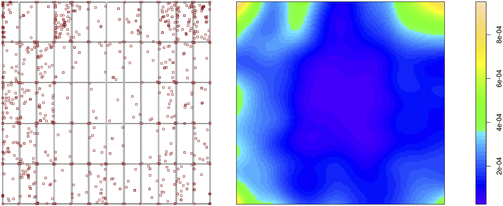

```
Version: 1.1.29
Removed MOR from authors, added as acknowledgement. Further revisions pending. 21.05.20.
```

[_DetectorChecker_](https://doi.org/10.5281/zenodo.3662233) 
refers to an R package and an associated web application, 
intended to help
users who need to analyze spatial patterns of defects in images.
These images can be _panel-structured_, which is to say,
composed of sub-panels arranged in  an architecture which
the user can specify in the package or in the web application.
Primary beneficiaries are intended to be individuals responsible for
high-value digital detector screens used in X-ray computerised tomography (XCT),
where defects arise due to high radiation flux.
More generally the software can be used to analyse defects in other
panel-structured arrays, for example solar panels or very large display screens.
To maximize accessibility, and to avoid any issues arising from specific software environments,
we have created a web application which provides
the principal features of the software in standalone form.
The web application also affords the possibility of engaging with our team in the analysis
of time-evolving
defect patterns.


Digital detector screens are crucial high-value components of imaging systems used throughout
modern science, medicine, and engineering systems, particularly in XCT.
The US @FDA provides information for industry on X-ray imaging devices
and lists some common laboratory tests for 
evaluation of general-use X-ray imaging devices.
It also notes the applicable standard 
for each modality, thus forming the basis for a maintenance schedule.
Additionally a scheduled testing framework has been proposed by the Institute of Physics and Engineering in Medicine [@IPEM2].
In September 2019 the UK National Health Service 
(NHS) announced a major investment of £200m to overcome outdated equipment, 
noting that a significant proportion of CT, MRI and general X-ray equipment more than 10 years old [@UK-NHS].
Thus XCT system quality concerns are very topical.

Yaffe and Rowlands [-@YaffeRowlands-1997, especially section 3.8]
point out that XCT screen quality is linked to system performance.
[_DetectorChecker_](https://doi.org/10.5281/zenodo.3662233) 
facilitates the inclusion of screen pixel assessment in a testing framework.
Note that screen replacement or refurbishment is expensive;
regular checks of screen pixels are needed (a) to quantify screen quality
and (b) to assess possible _special causes_ of defective pixels,
using Shewhart's [-@Shewhart-1939] terminology from classic quality control.
This is best done using spatial statistics,
both in order to determine the extent to which spatial patterns of defective pixels
can be accounted for by quantifiable independent random variation
and also by describing departures from spatial randomness in ways
which are suggestive of possible explanations (for example, stress due
to screen attachment, or failure at pixel level of data readout).
Theoretical spatial statistics methodology is crucial: foundations are discussed in @ChiuStoyanKendallMecke-2013
while
@BaddeleyRubakTurner-2015 describe the [_spatstat_](https://spatstat.org/) package, an implementation of spatial statistics methods in the
R statistical computing environment [@RFoundation-2019].
[_DetectorChecker_](https://doi.org/10.5281/zenodo.3662233)
[@tomas_lazauskas_2020_3662233] is an R package which adapts methods from [_spatstat_](https://spatstat.org/) to the case of panel-structured images,
and analyses point patterns arising either from
individual defects or from "clumps" of defects (determined in a manner specified by the user).
The associated web application
[_DetectorCheckerWebApp_](https://detectorchecker.azurewebsites.net/)
[@tomas_lazauskas_2020_3662235]
is based on a self-contained R environment together
with a [_Shiny_](https://cran.r-project.org/web/packages/shiny/index.html) gui, 
implemented and made available _via_ _Azure_ at https://detectorchecker.azurewebsites.net/.
The application exposes the
basic functionality of the [_DetectorChecker_](https://doi.org/10.5281/zenodo.3662233) package without the need for users to install R.
In particular the web application  can be used
to define the geometry of the sub-panels of the detector screen
(which is to say, the arrangement and size of the component sub-panels),
to upload the spatial arrangement of the defective pixels 
(either
directly by means of "bad pixel maps" in XML format or inferred from test images in formats including TIFF),
and then to inspect the results using the facilities offered
by the package.
The software is freely available under MIT licence, accessible _via_ the Github and Zenodo repositories
in the above references.
To the best of our knowledge, there is no comparable package or web application
making methods of spatial statistics available for panel-structured image data of arbitrary structure architecture.


Defects are modelled as points in an image rectangle based on overall screen dimensions. 
The pattern of defects can be modelled using the web application (workflow is
summarised in Figure \ref{fig:figure1}). We discuss these steps as they relate to 
data for a Pilatus detector
screen, supplied by Diamond Lightsource, UK.

A. The user specifies the exact architecture
of the sub-panels of the panel-structured image.
This can be done either by using a drop-down menu to specify a predetermined option,
or by uploading a file giving the specific structure of sub-panels.
The data can then be uploaded.

B. Intensity maps can be visualized _via_ kernel smoothing applied to the point pattern
(replacing each defect point by the corresponding translate of a fixed kernel function and then summing).
For example, the point pattern in Figure \ref{fig:figure2}(a) yields the intensity map given in Figure \ref{fig:figure2}(b).

C. Departure from _complete spatial randomness_ (CSR),
which is to say what would be expected if the point pattern was in fact
    generated by a homogeneous Poisson
    point process of constant intensity $\lambda$,
can be assessed using visual inspection of graphs
of empirical estimates of $F$, $G$ and $K$ functions as described in @ChiuStoyanKendallMecke-2013. It is clear that the
point pattern of Figure \ref{fig:figure2}(a) is strongly inhomogeneous and therefore it is
not surprising that the corresponding graphical plots 
indicate clear evidence of deviation from CSR:  
    
* The $F$ function or "empty space function"
computes the distribution of the nearest distance to a defect point from a typical location
chosen uniformly from the image rectangle; if the point pattern did in fact satisfy CSR then
an empirical estimate of the $F$ function could be viewed as a random perturbation of 
the theoretical $F$ function under CSR, namely
$F_\text{pois}(r)=1-\exp(-\lambda \pi r^2)$. See Figure \ref{fig:figure3}(a),
which presents different 
variants of $\hat{F}$ accounting in various ways for edge-effects.
Note the clear deviation of the $\hat{F}$ empirical estimates from what would be expected under CSR, 
namely the theoretical $F_\text{pois}$.

* The $G$ function computes the distribution of nearest-neighbour distances between defect points; if the point pattern did in fact satisfy CSR then
an empirical estimate of the $G$ function could be viewed as a random perturbation of
the theoretical $G$ function under CSR, namely
(by a conditional probability argument)
$G_\text{pois}(r)=1-\exp(-\lambda \pi r^2)$
(actually equal to $F_\text{pois}(r)$). 
See Figure \ref{fig:figure3}(b), and note the clear deviation
from the theoretical $G_\text{pois}$
of the $\hat{G}$ empirical estimates (which again account in various ways for edge-effects), 
hence again suggesting deviation from CSR.

* The $K$ function (Ripley's $K$ function) computes the mean number of defect points within a distance $r$ of a typical defect point, viewed as a function of $r$; if the point pattern did in fact satisfy CSR then
an empirical estimate of the $K$ function could be viewed as a random perturbation of the theoretical $K$ function
under CSR, namely
$K_\text{pois}(r)=\pi r^2$. See Figure \ref{fig:figure4}(a), and note the deviation from $K_\text{pois}$ 
of the $\hat{K}$ empirical estimates (once more accounting for edge-effects in different ways), especially at short distances, once more suggesting deviation from CSR.
Note that for geometrical reasons the
$\hat{K}$ empirical estimates will exhibit substantially greater variation at large distances;
it is therefore appropriate to confine attention to the left-hand third of the $x$-axis.
The excess over the theoretical $K_\text{pois}$ at short distances, particularly for the estimate $\hat{K}_\text{iso}$, indicates that defects are more clustered than would be expected from CSR. 

* Plots are also available which take account of inhomogeneity and compare these estimates to theoretical functions
computed for inhomogeneous Poisson point processes: 
Figure \ref{fig:figure4}(b) gives an example of this in the case of the $K$ function. The plots of the $\hat{K}_\text{inhom}$
empirical inhomogeneity-adjusted estimates agree much more closely with 
the theoretical $K^\text{pois}_\text{inhom}$ function 
at short distances, supporting the hypothesis that the pattern of defects is what
might be expected to arise from an _inhomogeneous_ Poisson process of defects.

D. Finally the relationship of the defect points to sub-panel boundaries can be studied by means of various logistic regression options, which assess whether damage intensity appears to depend on distance from the centre of the image or horizontal or vertical distance from sub-panel edges. When this data set is modelled in terms of Euclidean distance from the centre, the web application reports substantial evidence for positive dependence of defect intensity on distance from the centre (see the highly significant coefficient for `as.vector(dist)` in the following web application output), 
conforming with the visual impression given by Figure \ref{fig:figure2}(a). In fact this positive dependence reflects 
manufacturing details of
this particular screen design: Diamond reports that Pilatus detector screen panels are tested before installation, and better panels are placed in the centre of the structured display.

--------------------------------

```
Output from web application (Pilatus detector screen):

Call:
glm(formula = as.vector(pix_matrix) ~ as.vector(dist), family = binomial(link = logit))

Deviance Residuals: 
    Min       1Q   Median       3Q      Max
-0.0262  -0.0211  -0.0193  -0.0171   4.3297  

Coefficients:
                  Estimate Std. Error z value Pr(>|z|)    
(Intercept)     -9.392e+00  9.628e-02 -97.545   <2e-16 ***
as.vector(dist)  8.021e-04  8.726e-05   9.192   <2e-16 ***
---
Signif. codes:  0 ‘***’ 0.001 ‘**’ 0.01 ‘*’ 0.05 ‘.’ 0.1 ‘ ’ 1

(Dispersion parameter for binomial family taken to be 1)

    Null deviance: 22261  on 6224000  degrees of freedom
Residual deviance: 22173  on 6223999  degrees of freedom
AIC: 22177

Number of Fisher Scoring iterations: 11
```

--------------------------------





The web application also provides for further graphical options,
such as the study of direction from a typical defect point to
its nearest neighbour within the relevant sub-panel,
analysis at the level of "events" (appropriately defined grouping of clumps of defect pixels) rather than individual defect points,
and exclusion of regions of the image rectangle for which the defect intensity is clearly different
(this often arises in XCT, where corners of the image exhibit high defect intensity, presumably deriving from mechanical
stress due to supports of the screen).


An extended example of use of the R package, paralleled by corresponding use of the web application,
is available as a vignette in both Zenodo repositories.

The R package and web application together offer significant
opportunities to address interesting and important challenges for the data analysis of defective pixel patterns.
The web application offers the possibility of uploading users' data to
a data repository, thus permitting the possibility of organizing cooperative
statistical investigations comparing patterns across different machines and
different modes of usage. In particular we envisage its use to collect
time sequences of images, to permit statistical investigation by the Warwick team
of deterioration over time, using latent Markov models
of the life and death of defective pixels which are currently being developed.
Such analysis requires sustained and regular monitoring of a diversity
of screens from various devices, together with recording of relevant metadata
such as detector usage.
Interested users are encouraged to make contact to discuss these possibilities,
which will permit evidence-based analysis
to support decisions on refurbishment and / or replacement
strategies.

# Acknowledgements

We gratefully acknowledge support from the UK EPSRC (grant EP/K031066/1)
and the Alan Turing Institute (under the EPSRC
grant EP/N510129/1) during this project.

We also wish to thank Martin O'Reilly (the Turing Institute), Nicola Tartoni and Ian Horswell (Diamond Lightsource, UK) for guidance on detector types and sample data sets, and Tristan Lowe (Henry Moseley X-ray Imaging Facility, University of Manchester) 
and Martin Turner (ITS Research IT, University of Manchester) for discussions and feedback..

# References


