title: "DetectorChecker Usage"
# author: "Vignette Author"
date: "`r Sys.Date()`"
output: rmarkdown::html_vignette
vignette: >
  %\VignetteIndexEntry{Vignette Title}
  %\VignetteEngine{knitr::rmarkdown}
  %\VignetteEncoding{UTF-8}
---

```{r setup, include = FALSE}
knitr::opts_chunk$set(
  collapse = TRUE,
  comment = "#>"
)
```

# DetectorChecker

DetectorChecker package ...

## Loading and visualising data

### To check available layouts:

```
detectorchecker::available_layouts
```

It will output the list of implemented layouts, for example:

```
"Excalibur" "PerkinElmerFull" "Pilatus" 
```

### To create layout object

```
layout <- detectorchecker::create_module("Pilatus")
```

### To visualise layout object

```
detectorchecker::plot_layout(layout, "layout.pdf")
```

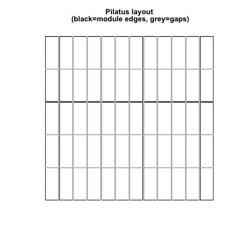

### Layout analysis

```
detectorchecker::plot_pixel_ctr_eucl(layout)
```

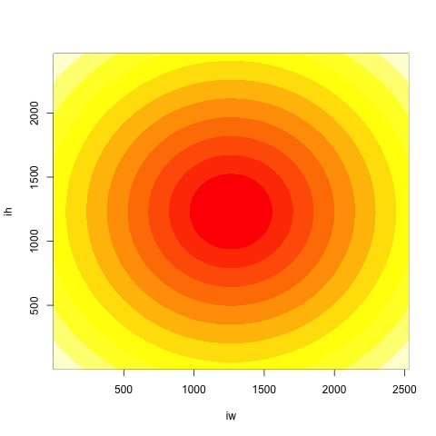

```
detectorchecker::plot_pixel_ctr_linf(layout)
```

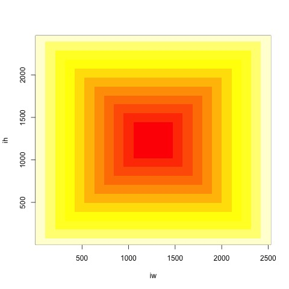

```
detectorchecker::plot_pixel_dist_corner(layout)
```

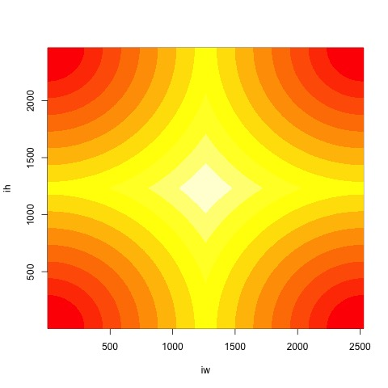

```
detectorchecker::plot_pixel_dist_edge_col(layout)
```
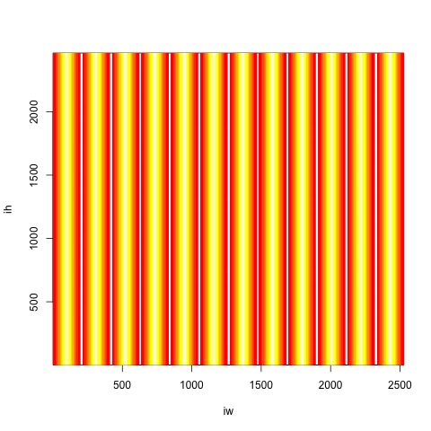

```
detectorchecker::plot_pixel_dist_edge_row(layout)
```
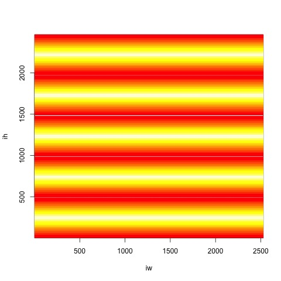

```
detectorchecker::plot_pixel_dist_edge(layout)
```
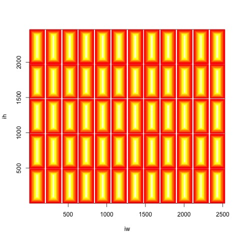

### To upload pixel file

#### TIFF format

```
# Choosing layout
layout <- detectorchecker::create_module("Pilatus")

# Loading the pixel matrix
dead_path <- "/Users/tlazauskas/git/Turing/DetectorChecker/Package/detectorchecker/tests/testthat/dead_pix/Pilatus/badpixel_mask.tif"
layout <- detectorchecker::load_pix_matrix(layout = layout, file_path = dead_path)

# Plotting
detectorchecker::plot_layout_damaged(layout = layout, file_path = "layout_damaged.jpg")
                      
```

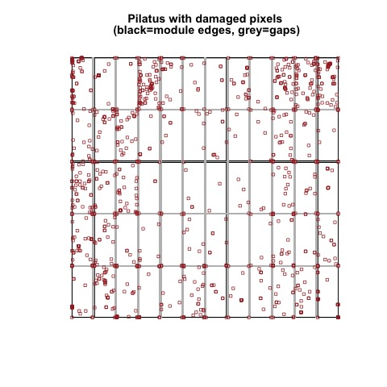

#### XML format

```
# Choosing layout
layout <- detectorchecker::create_module("PerkinElmerFull")

# getting the dead (damaged) pixel data
dead_path <- "/Users/tlazauskas/git/Turing/DetectorChecker/Package/detectorchecker/tests/testthat/dead_pix/PerkinElmer/BadPixelMap_0.bpm/BadPixelMap.bpm.xml"

layout <- detectorchecker::load_pix_matrix(layout = layout, file_path = dead_path)

# Plotting
detectorchecker::plot_layout_damaged(layout = layout, file_path = "layout_damaged.jpg")
```

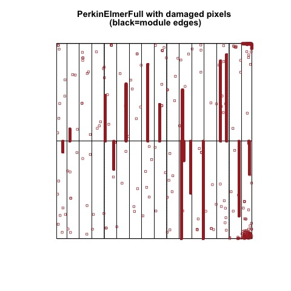

#### HDF

```
# Choosing layout
layout <- detectorchecker::create_module("Excalibur")

# Loading the pixel matrix
dead_path <- c("/Users/tlazauskas/git/Turing/DetectorChecker/Package/detectorchecker/tests/testthat/dead_pix/Excalibur/pixelmask.fem1.hdf", 
               "/Users/tlazauskas/git/Turing/DetectorChecker/Package/detectorchecker/tests/testthat/dead_pix/Excalibur/pixelmask.fem2.hdf",
               "/Users/tlazauskas/git/Turing/DetectorChecker/Package/detectorchecker/tests/testthat/dead_pix/Excalibur/pixelmask.fem3.hdf",
               "/Users/tlazauskas/git/Turing/DetectorChecker/Package/detectorchecker/tests/testthat/dead_pix/Excalibur/pixelmask.fem4.hdf",
               "/Users/tlazauskas/git/Turing/DetectorChecker/Package/detectorchecker/tests/testthat/dead_pix/Excalibur/pixelmask.fem5.hdf",
               "/Users/tlazauskas/git/Turing/DetectorChecker/Package/detectorchecker/tests/testthat/dead_pix/Excalibur/pixelmask.fem6.hdf")

layout <- detectorchecker::load_pix_matrix(layout = layout, file_path = dead_path)

# Plotting
detectorchecker::plot_layout_damaged(layout = layout, file_path = "layout_damaged.jpg")
                      
```

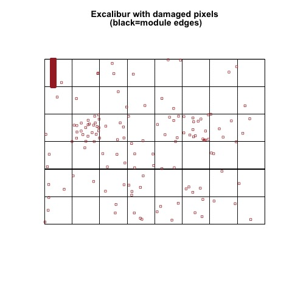

### Damaged pixel density
```
# Choosing layout
layout <- detectorchecker::create_module("PerkinElmerFull")

# Loading the pixel matrix
test_path <- "/Users/tlazauskas/git/Turing/DetectorChecker/Package/detectorchecker/tests/testthat/dead_pix/PerkinElmer/BadPixelMap_0.bpm/BadPixelMap.bpm.xml"

layout <- detectorchecker::load_pix_matrix(layout = layout, file_path = test_path)

detectorchecker::plot_layout_density(layout = layout, file_path = "perkinelmerfull_density.jpg", adjust = 0.5)
```

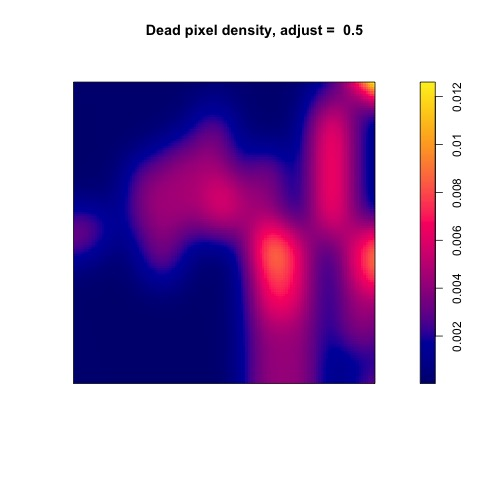

### Summaries

```
# Choosing layout
layout <- detectorchecker::create_module("PerkinElmerFull")

# Loading the pixel matrix
test_path <- "/Users/tlazauskas/git/Turing/DetectorChecker/Package/detectorchecker/tests/testthat/dead_pix/PerkinElmer/BadPixelMap_0.bpm/BadPixelMap.bpm.xml"

layout <- detectorchecker::load_pix_matrix(layout = layout, file_path = test_path)
layout <- detectorchecker::get_dead_stats(layout)

cat(detectorchecker::layout_summary(layout))
cat(detectorchecker::dead_stats_summary(layout))
```

```
Detector: 
  Name:  PerkinElmerFull 
  Date:  NA 
  Width:  2000 
  Height:  2000 
  Number of columns in array of module (= number of modules per row):  16 
  Number of rows in array of module (= number of modules per column):  2 
  Widths of modules:  104 128 128 128 128 128 128 128 128 128 128 128 128 128 128 104 
  Heights of modules:  1000 1000 
  Widths of gaps between modules:  0 0 0 0 0 0 0 0 0 0 0 0 0 0 0 
  Heights of gaps between modules:  0 
```
```
  Total number of damaged pixels:  9451 
  Total number of modules:  32 
  Average number of damaged pixels per module:  295.3 
  
  Chi-Squared Test results:
  Xsq =  23280.5170881388 , Xsq df =  31 , Xsq p =  0 
```

### Damaged pixel counts per module
```
test_out_path <- "layout_module_cnt.jpg"
detectorchecker::plot_layout_cnt_mod(layout = layout, file_path = test_out_path)

```
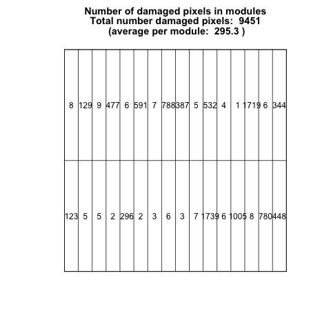


## Model fitting

```
# Choosing layout
layout <- detectorchecker::create_module("Pilatus")

# Loading the pixel matrix
dead_path <- "/Users/tlazauskas/git/Turing/DetectorChecker/Package/detectorchecker/tests/testthat/dead_pix/Pilatus/badpixel_mask.tif"

layout <- detectorchecker::load_pix_matrix(layout = layout, file_path = dead_path)

glm_fit <- detectorchecker::glm_pixel_ctr_eucl(layout = layout)

summary(glm_fit)
```

```
Call:
glm(formula = symb_expr, family = family)

Deviance Residuals: 
    Min       1Q   Median       3Q      Max  
-0.0262  -0.0211  -0.0193  -0.0171   4.3297  

Coefficients:
                  Estimate Std. Error z value Pr(>|z|)    
(Intercept)     -9.392e+00  9.628e-02 -97.545   <2e-16 ***
as.vector(dist)  8.021e-04  8.726e-05   9.192   <2e-16 ***
---
Signif. codes:  0 ‘***’ 0.001 ‘**’ 0.01 ‘*’ 0.05 ‘.’ 0.1 ‘ ’ 1

(Dispersion parameter for binomial family taken to be 1)

    Null deviance: 22261  on 6224000  degrees of freedom
Residual deviance: 22173  on 6223999  degrees of freedom
AIC: 22177

Number of Fisher Scoring iterations: 11
```

#### Similarly:
```
# Choosing layout
layout <- detectorchecker::create_module("Pilatus")

# Loading the pixel matrix
dead_path <- "/Users/tlazauskas/git/Turing/DetectorChecker/Package/detectorchecker/tests/testthat/dead_pix/Pilatus/badpixel_mask.tif"

layout <- detectorchecker::load_pix_matrix(layout = layout, file_path = dead_path)

glm_fit <- detectorchecker::glm_pixel_ctr_linf(layout)

glm_fit <- detectorchecker::glm_pixel_dist_edge_col(layout)

glm_fit <- detectorchecker::glm_pixel_dist_edge_row(layout)

# Custom

dist_col <- detectorchecker::dist_edge_col(layout)
dist_row <- detectorchecker::dist_edge_row(layout)

glm_fit <- detectorchecker::perform_glm(as.vector(layout$pix_matrix) ~ as.vector(dist_col) + as.vector(dist_row))

```
