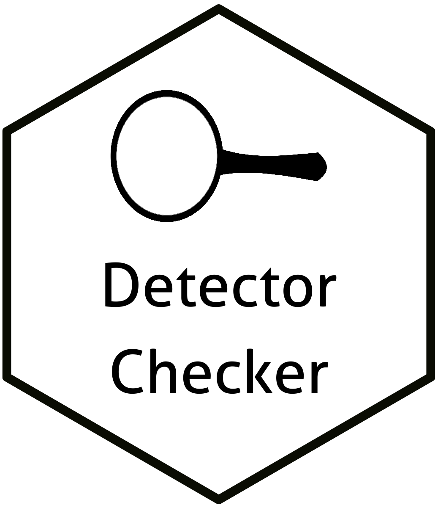

# DetectorChecker <a></a>

Master: [](https://travis-ci.com/alan-turing-institute/DetectorChecker) Develop: [](https://travis-ci.com/alan-turing-institute/DetectorChecker)

[](https://zenodo.org/badge/latestdoi/144782935)
[](https://opensource.org/licenses/MIT)

Created by: [Julia Brettschneider](https://github.com/ejulia17) (original R code), [Wilfrid Kendall](https://github.com/WilfridSKendall) (testing and editing),
[Tomas Lazauskas](https://github.com/tomaslaz) (R package engineering) and [Oscar Giles](https://github.com/OscartGiles) (package development)

## Overview

DetectorChecker is an R package to aid in the assessment of damage to CT scanners arising from exposure to high energy radiation.
While the target application concerns CT scanners, this package can also be used to analyze screen damage arising from other sources.


## Installation

To install from github you will need to have the [devtools](https://github.com/r-lib/devtools) package installed.

In R run one of the following, depending on whether you want to build the package Vignettes, removing the # if you do not have devtools installed:

```
# install.packages("devtools")
devtools::install_github("alan-turing-institute/DetectorChecker")
```


If you want to be able to view the user_guide Vignette you need to install with:
```
devtools::install_github("alan-turing-institute/DetectorChecker", build_vignettes = TRUE, build_opts = c("--no-resave-data", "--no-manual"))
```
Installing with the vignettes may be slow (~10 min)


### Development version

```
# install.packages("devtools")
devtools::install_github("alan-turing-institute/DetectorChecker", ref = "develop")
```


## WebApp

The official release of the DetectorChecker WebApp is hosted at https://detectorchecker.azurewebsites.net.

The source code for the WebApp implementation can be found on GitHub: (https://github.com/alan-turing-institute/DetectorCheckerWebApp).


## Vignette

The user guide vignette provides detailed instructions for using the package and loading specific examples. Make sure you installed the package including vignette following the instructions above (see use of build_vignettes = TRUE in Section Installation) and then load the package followed by the vignette command:

```
library(detectorchecker)
vignette("user_guide", package = "detectorchecker")
```

## Manual
Documentation is provided as a [pdf](docs/detectorchecker_0.1.10.pdf)

## Examples
DetectorChecker includes a number of example datasets for five detector types:

1. Pilatus

2. PerkinElmer

3. PerkinElmer Refurbished

4. PerkinElmer Cropped

5. Excalibur

To load an example dataset you can either call:
```
library(detectorchecker)

#Inititate a PerkinElmerFull detector object
detector <-  create_detector("PerkinElmerFull")

# Path of dataset
file_path <- system.file("extdata", "PerkinElmer_Full", "BadPixelMap.bpm", "BadPixelMap_t1.bpm.xml", package = "detectorchecker")

# Load a pixel matrix into the detector object
detector <- load_pix_matrix(detector = detector, file_path = file_path)
```

or you can load one of the examples by calling:

```
library(detectorchecker)
data(PerkinElmerFull_exp_1)
```

which creates an appropriate detector module and loads an example pixel dataset.

For see the full list of example datasets call

```
data(package = "detectorchecker")
```

## Citation
If you use DetectorChecker in your work please cite our package.

BibTeX:

```
@software{tomas_lazauskas_2020_3662233,
  author       = {Tomas Lazauskas and
                  Oscar T Giles and
                  Martin O'Reilly and
                  Wilfrid Kendall and
                  Julia Brettschneider},
  title        = {{alan-turing-institute/DetectorChecker}},
  month        = feb,
  year         = 2020,
  publisher    = {Zenodo},
  version      = {1.0.0},
  doi          = {10.5281/zenodo.3662233},
  url          = {https://doi.org/10.5281/zenodo.3662233}
}
```

## Getting help
If you found a bug or need support, please submit an issue [here](https://github.com/alan-turing-institute/DetectorChecker/issues/new).

## How to contribute
We welcome contributions! If you are willing to propose new features or have bug fixes to contribute, please submit a pull request [here](https://github.com/alan-turing-institute/DetectorChecker/pulls).
