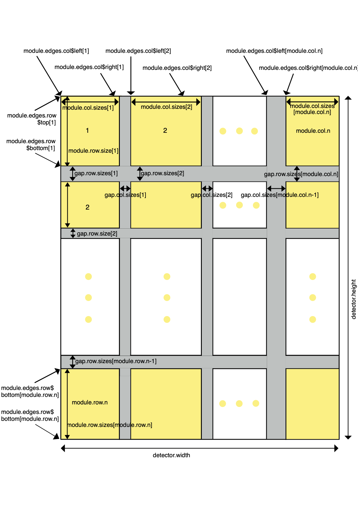

---
output:
  html_document:
    fig_caption: yes
  pdf_document:
    fig_caption: yes
title: "DetectorChecker Usage"
author: "Julia Brettschneider, Oscar Giles, Tomas Lazauskas, Wilfrid Kendall"
date: "`r Sys.Date()`"
vignette: >
  %\VignetteIndexEntry{DetectorChecker Usage}
  %\VignetteEncoding{UTF-8}
  %\VignetteEngine{knitr::rmarkdown}
---

```{r setup, include = FALSE}
knitr::opts_chunk$set(
  collapse = TRUE,
  comment = "#>"
)
```

# DetectorChecker

The DetectorChecker `R` package offers a quality check of digital X-ray detectors based on spatial analysis of damaged pixel distributions. It can also be used for analysing other types of defects on other types of instruments, as long as the data is similar. For example, instead of damaged pixels, the spatial arrangement of other types of dysfunctional pixels could be analysed. For an example of a different
type of instrument, consider CMOS sensors as used in digital cameras. 

Here is how to load the package. 
```{r}
library(detectorchecker)
```

## Loading and visualising detector layout and data

The elementary units (e.g. pixels) have to be arranged in a rectangular grid. The grid may be divided into rectangular modules, which may be separated by gaps. There are technical reasons for such gaps, and they are excluded from the analysis. 

### Check available detectors

Several predefined detector layouts are already included in the package. `Pilatus`, `Excalibur` and `PerkinElmerFull` (2000 by 2000 pixels) are common types of detectors built into professional X-ray machines. `PerkinElmerCropped1600` and `PerkinElmerRefurbished` are modified version of `PerkinElmerFull`; they were created by restricting the area. 
A list with all available detector layouts can be displayed.

```{r}
available_detectors
```

If your data has been created using one of the predefined layouts
then it suffices to upload the relevant detector layout.
Otherwise a user-defined layout can be specified by reading in an
appropriate text file as explained further below.

### Create detector object from available layouts

The first step is to create an `R` object with the layout matching your data set. 
Here are example invocations for `Pilatus` and `PerkinElmer_Full`.

```{r}
detector_pilatus <- create_detector("Pilatus")
detector_perkinfull <- create_detector("PerkinElmerFull")
```

A summary of the characteristics of the detector layout can be printed.

```{r}
cat(detector_summary(detector_pilatus))
```

We will now explain the attributes of this object using `Pilatus` and `PerkinElmerFull` as examples. 
The first four attributes contain the name, a date (optional; use `NA` if there is no need to specify this),
the width (number of pixels horizontally) and the height (numbers of pixels vertically) of the detector. 

```{r}
paste("name:", detector_pilatus$name)
paste("date:", detector_pilatus$date)
paste("width:", detector_pilatus$detector_width)
paste("height", detector_pilatus$detector_height)
```

The grid layout is given by the following attributes The number of modules per row is given by the module_row_n attribute and per column in module_col_n.

```{r}
paste("module_col_n:", detector_pilatus$module_col_n)
paste("module_row_n:", detector_pilatus$module_row_n)
```

The sizes of the modules are stored in the next two attributes. `module_col_sizes` contains the widths (numbers of pixel columns in each module), while `module_row_sizes` contains the heights (numbers of pixel rows in each module). In the `Pilatus` detector all modules are of the same dimensions. In the `PerkinElmerFull` the first and last module of each row have fewer pixels.

```{r}
print("Pilatus: Cols and Rows")
detector_pilatus$module_col_sizes
detector_pilatus$module_row_sizes

print("Perkinfull: Cols and Rows")
detector_perkinfull$module_col_sizes
detector_perkinfull$module_row_size
```

The next two attributes contain the sizes of the gaps. The numbers of pixel columns per gap are in `gap_col_sizes`, while the numbers of pixels rows per gap are in `gap_row_sizes`
In the `Pilatus` detectors all horizontal gaps are of the same size, and all vertical gaps are of the same size. The various Perkin Elmer detectors and the `Excalibur` detector have no gaps at all. However, it is possible to create layouts with more irregular gap sizes (see the comments below on user-defined layouts).

```{r}
print("Pilatus: Gap Cols and Rows")
detector_pilatus$gap_col_sizes
detector_pilatus$gap_row_sizes

print("Perkinfull: Gap Cols and Rows")
detector_perkinfull$gap_col_sizes
detector_perkinfull$gap_row_sizes
```

Slots 9 and 10 are calculated from the other slots; they contain the left and the right edge (column numbers) and the top and bottom edge (row numbers) of each module. If there are no gaps, such as in the three Perkin Elmer layouts, then the left edge of a module will be adjacent to the right edge of the previous one in the same row of the grid and the bottom edge of a module will be adjacent to the top edge of the previous one.

```{r}
print("Pilatus: Gap Cols and Rows")
detector_pilatus$module_edges_col
detector_pilatus$module_edges_row

print("Perkinful: Gap Cols and Rows")
detector_perkinfull$module_edges_col
detector_perkinfull$module_edges_row
```

The final attribute `detector_inconsistency` is a consistency check. If the sizes of the modules add up to the correct numbers, the status is 0. Otherwise, it is 1 and a suitable error message will be produced. The remaining slots will be filled when the detector damage information is read in.

```{r}
detector_pilatus$detector_inconsistency
```


### Create detector object from user-defined layouts

If your detector's layout is not contained in the list then you can create and read in the relevant layout parameters. You need to create a textfile that contains this information in a simple list setting all relevant parameters and store it in a directory of your choice.

We illustrate this by two examples. The first example is a simple layout for a detector with photographic aspect ratio with no subdivisions. We stored the lines below as a plain text file under the name  `layout_par_photographic.txt` in the subdirectory 
`extdata/user-defined/photographic/` of the `detectorchecker`package.

```{r}
detector_width = 600
detector_height = 400
module_col_n = 1
module_row_n = 1
module_col_sizes = c(600)
module_row_sizes = c(400)
gap_col_sizes = c()
gap_row_sizes = c()
module_edges_col = NA
module_edges_row = NA
```

The second example is an irregular layout with varying module dimensions and varying gap sizes. We stored the lines below as a plain text file under the name `layout_par_irregular.txt` in the subdirectory 
`extdata/user-defined/irregular/` of the `detectorchecker`package.

```{r}
detector_width = 1720
detector_height = 1060
module_col_n = 7
module_row_n = 5
module_col_sizes = c(100, 200, 300, 400, 300, 200, 100)
module_row_sizes = c(100, 200, 400, 200, 100)
gap_col_sizes = c(10,20,30,30,20,10)
gap_row_sizes = c(10,20,20,10)
module_edges_col = NA
module_edges_row = NA
```

To generate a detector object from user-defined parameters, we use a function reading the parameters from the text file as shown below for our examples. For your own user-defined detector you need to set the variable `file_path` to point to the directory where you stored the parameter file.

```{r}
file_path <-  system.file("extdata", "user-defined", 
                          "photographic", "layout_par_photographic.txt", 
                          package ="detectorchecker")
user_def_detector_photographic <- readin_detector(file_path)
file_path <-  system.file("extdata", "user-defined", 
                          "irregular", "layout_par_irregular.txt", 
                          package ="detectorchecker")
user_def_detector_irregular <- readin_detector(file_path)
```

### Visualise detector object

A visualisation of the layout shows modules and gaps as shown below for two of the pre-specified layouts. The default is to plot a title, but we can override this by setting the parameter caption to `FALSE`. The same rule applies for all plots produced using this package.

```{r}
plot_detector(detector_pilatus)
plot_detector(detector_pilatus, caption=FALSE)
plot_detector(detector_perkinfull)
```

This also works for the two user-defined detectors.
```{r}
plot_detector(user_def_detector_photographic)
plot_detector(user_def_detector_irregular)
```


### Detector geometry

The class for detectors considered admissible for this package is illustrated by Figure \ref{fig:detector_layout}



### Upload files containing pixel damage locations

The next step is to upload a file containing information about damaged pixel locations. The format depends on what is provided for the detector type. 

#### `TIF` format

For `Pilatus`, the damaged pixels locations are usually provided as bad pixel masks in the form of `tif` files. A sample file with raw damaged pixel mask data is provided with the package and can be loaded by specifying the relevant folder location (here `extdata`) and file name (here `Pilatus/badpixel_mask.tif`). 

```{r}
detector_pilatus <- create_detector("Pilatus")  
file_path <-  system.file("extdata", "Pilatus", "badpixel_mask.tif", 
                          package ="detectorchecker")
detector_pilatus <- load_pix_matrix(
  detector = detector_pilatus, file_path = file_path)
```

The spatial locations of the damaged pixels can be visualised.

```{r}
plot_pixels(detector = detector_pilatus)
```

Individual modules can be plotted separately. 
Here we plot the module located in the 4^th^ column and 5^th^ row of the module layout grid.

```{r}
plot_pixels(detector = detector_pilatus, 
            col = 4, row = 5)
```

For the user-defined layout used above we can also display damaged pixels. If the location are stored in the form of a `tif` file then this looks as follows.

```{r}
file_path <-  system.file("extdata", "user-defined", 
                          "photographic", "photographic.tif", 
                          package ="detectorchecker")
user_def_detector_photographic <- load_pix_matrix(
  detector = user_def_detector_photographic, file_path = file_path)
plot_pixels(detector = user_def_detector_photographic, caption = TRUE)
```

#### `XML` format

For the three Perkin Elmer layouts (`PerkinElmerFull`, `PerkinCropped1600`, and `PerkinElmerRefurbished`) the damaged pixels locations are usually stored as `xml` files. Sample files for each of the three Perkin Elmer layouts are supplied with the package and can be loaded by specifying the location and file name. 

```{r}
detector_perkinfull <- create_detector("PerkinElmerFull")
file_path <-  system.file("extdata", "PerkinElmerFull", 
                          "BadPixelMap_t1.bpm.xml",
                          package = "detectorchecker")
detector_perkinfull <- load_pix_matrix(
  detector = detector_perkinfull, file_path = file_path)
plot_pixels(detector = detector_perkinfull)
plot_pixels(detector = detector_perkinfull, 
            col = 11, row = 1)
```

To plot another of the `Perkin Elmer` layouts the detector type needs to be changed. For the refurbished detector layout this is done as follows:
To plot another of the Perkin Elmer layouts the detector type needs to be changed. For the refurbished detector layout this is done as follows:

```{r}
detector_perkinrefurb <- create_detector("PerkinElmerRefurbished")
file_path <-  system.file("extdata", "PerkinElmerRefurbished", 
                          "BadPixelMap_t1.bpm.xml", 
                          package = "detectorchecker")
detector_perkinrefurb <- load_pix_matrix(
  detector = detector_perkinrefurb, file_path = file_path)
plot_pixels(detector = detector_perkinrefurb)
```

To see the other sample data sets, change the file name, e.g.:

```{r}
detector_perkinrefurb <- create_detector("PerkinElmerRefurbished")
file_path <-  system.file("extdata", "PerkinElmerRefurbished", 
                          "BadPixelMap_t2.bpm.xml", 
                          package = "detectorchecker")
detector_perkinrefurb <- load_pix_matrix(
  detector = detector_perkinrefurb, file_path = file_path)
plot_pixels(detector = detector_perkinrefurb)
```

This also works for a user-defined detector if the damaged pixel locations are stored in `xml` format. (Dead pixels locations in the example file were generated by simulating a Poisson point pattern with inhomogeneous density.)

```{r}
file_path <-  system.file("extdata", "user-defined", "photographic",
                          "badpixelmap_photographic_inhom.xml", 
                          package ="detectorchecker")
user_def_detector_photographic <- load_pix_matrix(
  detector = user_def_detector_photographic, file_path = file_path)
plot_pixels(detector = user_def_detector_photographic, 
            caption = TRUE)
```

For the second user-defined example, we proceed similarly.

```{r}
file_path <-  system.file("extdata", "user-defined", 
                          "irregular", "badpixelmap_irregular.xml", 
                          package ="detectorchecker")
user_def_detector_irregular <- load_pix_matrix(
  detector = user_def_detector_irregular, file_path = file_path)
plot_pixels(detector = user_def_detector_irregular)
```
#### `HDF` format

For `Excalibur`, the damaged pixels locations are usually provided in a combination of 6 `hdf` files corresponding to the layout rows. One such collection of sample files is provided with the package.

```{r}
detector_exc <- create_detector("Excalibur")

file_path <-  c(
  system.file("extdata", "Excalibur", "pixelmask.fem1.hdf", 
              package ="detectorchecker"),
  system.file("extdata", "Excalibur", "pixelmask.fem2.hdf", 
              package ="detectorchecker"),
  system.file("extdata", "Excalibur", "pixelmask.fem3.hdf", 
              package ="detectorchecker"),
  system.file("extdata", "Excalibur", "pixelmask.fem4.hdf", 
              package ="detectorchecker"),
  system.file("extdata", "Excalibur", "pixelmask.fem5.hdf", 
              package ="detectorchecker"),
  system.file("extdata", "Excalibur", "pixelmask.fem6.hdf", 
              package ="detectorchecker")
  )
detector_exc <- load_pix_matrix(
  detector = detector_exc, file_path = file_path)
plot_pixels(detector = detector_exc)
```

As for the other layout types, individual modules can be plotted.

```{r}
plot_pixels(detector = detector_exc,
            col = 6, row = 4)
```


## Analysis of damaged pixels

### Density

Approximate damage intensity can be visualized by plotting a density. The parameter `adjust` must be positive and can be varied to tune the smoothness of the density estimation procedure.

```{r}
plot_pixels_density(detector = detector_pilatus)
plot_pixels_density(detector = detector_perkinfull)
plot_pixels_density(detector = user_def_detector_photographic)
```

The same plot can be carried out for individual modules. In the case of a density map, the smoothing chosen for the sub-panel is different from that chosen for the plot for the entire panel, so it will not simply be a detail of the larger image.

```{r}
plot_pixels_density(detector = detector_pilatus, 
                    row = 5, col = 1)
```

The parameter `adjust` influences the bandwidth used in the kernel based density estimation. The default is set at 0.5. Smaller values will emphasise the role of individual pixels, while larger values result in smoothing over larger areas.

```{r}
plot_pixels_density(detector = detector_pilatus, adjust=0.1)
plot_pixels_density(detector = detector_pilatus, adjust=2)
```


### Numerical summaries

A calculation of the total number of damaged pixels, the average number of damaged pixels per module, and a Chi-square test for its independence of the module can be performed. We show this here for `Pilatus`, preceded by a summary of the relevant layout characteristics.

```{r}
cat(detector_summary(detector_pilatus))
cat(dead_stats_summary(detector_pilatus))
```

A systematic display of the counts of damaged pixels per module can be displayed for the whole detector or for an individual module.

```{r}
detector_pilatus <- get_dead_stats(detector_pilatus)
plot_pixels_count(detector = detector_pilatus)
plot_pixels_count(detector = detector_pilatus, 
                  row = 5, col = 12)
```


### Arrows to nearest neighbours

For each damaged pixel, a nearest neighbour can be determined and all such relationships can be visualised by plotting directed arrows. Specifying coordinates in the layout grid plots only the corresponding modules. We illustrate this for one of the Perkin Elmer data examples.

```{r}
plot_pixels_arrows(detector = detector_perkinfull)
plot_pixels_arrows(detector = detector_perkinfull, 
                   row = 1, col = 1)
```


### Angles between nearest neighbours

Angles between neighbours can be summarised in a rose diagram.

```{r}
plot_pixels_angles(detector = detector_pilatus)
```

In some modules, the rose diagram is dominated by vertical and horizontal directions. However, in other modules this is not the case. 

```{r}
plot_pixels_angles(detector = detector_pilatus, 
                   row = 5, col = 11)
plot_pixels_angles(detector = detector_pilatus, 
                   row = 5, col = 4)
```

## Analysis of complete spatial randomness

A number of distance-based functions can be used to check whether
the point pattern created by the damaged pixels has 
features that would be expected from a pattern exhibiting complete spatial randomness: 
Ripley's $K$ function, the empty space function $F$ and the nearest-neighbour function $G$. Scales of the axes are chosen by `spatstat` default.

### $K$, $F$, $G$ function plots

The basic versions of these functions assume a homogeneous background density. 

```{r}
plot_pixels_kfg(detector = detector_pilatus, func = "K")
plot_pixels_kfg(detector = detector_pilatus, func = "F")
plot_pixels_kfg(detector = detector_pilatus, func = "G")
```

Individual modules can be selected as before. The functions consistently show a deviation from what would be expected from complete spatial randomness (which is graphed as `K_pois`). Note that there are several different empirical variants of each function, corresponding to different edge-correction techniques.

```{r, fig.show='hide'}
plot_pixels_kfg(detector = detector_pilatus, func = "K", 
                row = 5, col = 12)
plot_pixels_kfg(detector = detector_pilatus, func = "F", 
                row = 5, col = 12)
plot_pixels_kfg(detector = detector_pilatus, func = "G", 
                row = 5, col = 12)
```


### Inhomogeneous K, F, G plots

There are also versions of these functions that allow for an inhomogeneous background density (itself estimated from the data).

```{r}
plot_pixels_kfg(detector = detector_pilatus, func = "Kinhom")
plot_pixels_kfg(detector = detector_pilatus, func = "Finhom")
plot_pixels_kfg(detector = detector_pilatus, func = "Ginhom")
```

As is the case for their homogeneous counterparts, they can also be computed for individual modules.

```{r, fig.show='hide'}
plot_pixels_kfg(detector = detector_pilatus, func = "Kinhom", 
                row = 5, col = 12)
plot_pixels_kfg(detector = detector_pilatus, func = "Finhom", 
                row = 5, col = 12)
plot_pixels_kfg(detector = detector_pilatus, func = "Ginhom", 
                row = 5, col = 12)
```


## Analysis of damage events

Instead of interpreting every damaged pixel by itself, small clusters and lines can be interpreted as one damage event. Create a new object by specifying which kinds of small ensembles should be summarised as damage events (1=singletons, 2=doublets, 3=triplets, 4=larger clusters, 5=upper horizontal lines, 6=lower horizontal lines, 7=left vertical lines, 8=right vertical lines). To include all kinds of ensembles list them all. 

The differences between pixel and event level are demonstrated well e.g. in the `PerkinElmerFull` example data sets, because they possess lines of damaged pixels. 

```{r}
incl_event_list <- list(1,2,3,4,5,6,7,8)
detector_perkinfull_events <- detectorchecker::find_clumps(detector_perkinfull)
```

For the Perkin Elmer damaged pixel example files, there is an obvious difference between the pixel level (first plot below) and the event level (second plot below).

```{r}
plot_pixels(detector_perkinfull)
detectorchecker::plot_events(detector_perkinfull_events, 
                             incl_event_list = incl_event_list)
```

An individual module can be plotted by referring to the corresponding row and column.

```{r}
plot_pixels(detector_perkinfull, 
            row = 1, col = 11)
plot_events(detector_perkinfull_events, 
            incl_event_list = incl_event_list, 
            row = 1, col = 11)
```

Much of the analysis carried out on the pixel level can also be conducted on the event level.

### Numerical summaries

A graphical display of the counts of damage events per module can be displayed for the whole detector or a module.

```{r}
detectorchecker::plot_events_count(detector_perkinfull_events, 
                                   incl_event_list = incl_event_list)
```

### Density

For density plots the optional adjust parameter can be omitted (default=0.5) or changed to another positive value. Individual modules can be selected.

```{r}
detectorchecker::plot_events_density(detector_perkinfull_events, 
                                     incl_event_list = incl_event_list)
detectorchecker::plot_events_density(detector_perkinfull_events, 
                                     incl_event_list = incl_event_list, 
                                     row=1, col=16, adjust=1)
```

### Arrows between nearest neighbours 

For the complete detector or for individual modules:

```{r}
detectorchecker::plot_events_arrows(detector_perkinfull_events, 
                                    incl_event_list = incl_event_list)
detectorchecker::plot_events_arrows(detector_perkinfull_events, 
                                    incl_event_list = incl_event_list, row=1, col=16)
```

### Angles between nearest neighbours 

For the complete detector or for individual modules:

```{r}
detectorchecker::plot_events_angles(detector_perkinfull_events, 
                                    incl_event_list = incl_event_list)
detectorchecker::plot_events_angles(detector_perkinfull_events, 
                                    incl_event_list = incl_event_list, 
                                    row=1, col=16)
```

## Analysis of complete spatial randomness

This can be conducted in the same way as for the pixel level. It is worth comparing the results on the pixel level with those on the event level, because results may be different. We show below a number of ways to do this for the $K$ function. Similar approaches work for $F$ and $G$ functions.

```{r}
detectorchecker::plot_events_kfg(detector_perkinfull_events, func = "K",
                                 incl_event_list = incl_event_list)
detectorchecker::plot_events_kfg(detector_perkinfull_events, func = "K",
                                 incl_event_list = incl_event_list, row=1, col=16)
detectorchecker::plot_events_kfg(detector_perkinfull_events, func = "Kinhom", 
                                 incl_event_list = incl_event_list)
```

## Removing areas of high density pixel damage 

In some situations, the analysis may be dominated by an area of elevated damage. The investigation of complete spatial randomness then becomes uninformative. The area with elevated damage can be removed. 

```{r}
detector_perkinfull_modified <- remove_high_density_cluster(
  detector_perkinfull, min_pts = 30, eps_adjust = 0.05)
plot_pixels(detector = detector_perkinfull_modified)
``` 

The analysis for complete spatial randomness can be conducted on the remaining area.  
```{r}
plot_pixels_kfg(detector = detector_perkinfull_modified, func = "K")
plot_pixels_kfg(detector = detector_perkinfull_modified, func = "F")
plot_pixels_kfg(detector = detector_perkinfull_modified, func = "G")
```


## Models

This section concerns inferential statistical methods to analyse the state (damaged or intact) of the pixels. General linear models can include a spatial covariate reflecting the location of a pixel relative to the centre, to the edges or the corners of the detector. 
The spatial covariate can also express the location relative to its containing module (sub-panel).
This can be distance of the pixel to the closest vertical or horizontal edge of the containing module, or the minimum of both of these (i.e. the distance to the closest edge of the containg module).
Running times can be slow, but should not take longer than a minute
for detector types included in this package
when using a notebook computer of normal specification (as of 2020). 

We start with the spatial covariates that reflect the geometry of the pixels with respect to the detector as a whole. 
The following command fits a model that includes the euclidean distance of a pixel to the centre of the detector as covariate.
```{r}
glm_pixel_ctr_eucl(detector_pilatus)
```

The next command includes the maximum of the vertical and horizontal distances of a pixel to the centre of the detector (also called $L^\infty$ or L-infinity distance). 
```{r}
glm_pixel_ctr_linf(detector_pilatus)
```

It is also possible to include the distances of a pixel to the nearest corner of the detector as a covariate.

```{r}
glm_pixel_dist_corner(detector_pilatus)
```

Now we look at covariates that reflect the position of the pixel with respect to the containing module.
The function `glm_pixel_dist_edge_col()` fits a model that includes the distance of the relevant pixel
from the nearest vertical edge of the containing module.

```{r}
glm_pixel_dist_edge_col(detector_pilatus)
```

The function `glm_pixel_dist_edge_row()` does the same for rows, and `glm_pixel_dist_edge_min()` uses the smaller distance of the two. 

All these commands are also available on the event level by using the same name but 
substituting `events` for `pixel` in the command name.  
For example, the following command fits a model that includes
as covariate the euclidean distance of an event to the centre.

```{r}
glm_events_ctr_eucl(detector_pilatus)
```

For illustrative purposes it is also possible to visualise the spatial covariates. 
(This step would typically be missed out, since the plotting process is quite slow.)

The function `plot_pixel_ctr_eucl()` displays euclidean distance of pixels
to the centre of the detector using a colour scheme. 
The function `plot_pixel_ctr_linf()` displays the maximum of the vertical and horizontal distances of a pixel to the centre of the detector (also called $L^\infty$ or L-infinity distance). 
The next command displays euclidean distance of pixels to the nearest corner.

```{r}
plot_pixel_dist_corner(detector_pilatus)
```

The function `plot_pixel_dist_edge_col()` displays distance of pixels from the nearest vertical module edge, while `plot_pixel_dist_edge_row()` does the same for horizontal boundaries. 
In conclusion, the following command is based on 
the minimum of the distances displayed by `plot_pixel_dist_edge_col()`
and `plot_pixel_dist_edge_row()`;
in other words, it displays the distance of pixels to nearest module edge.

```{r}
plot_pixel_dist_edge(detector_pilatus)
```


